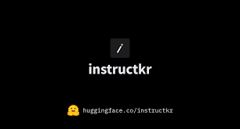

# 重写版 Claw Code 项目

<p align="center">
  <a href="README.md">English</a> · <a href="README.zh-CN.md">简体中文</a>
</p>

<p align="center">
  <strong>不是简单存档泄露代码，而是把 Claw Code 的 harness 思路做成可维护、可验证、可继续移植的工程。</strong>
</p>

## 项目概览

这个仓库当前有三条主线：

- `src/`：Python clean-room 重写工作区
- `rust/`：Rust 系统语言移植
- `csharp/`：C# 镜像工作台与自动化测试

仓库的重点不再是保留暴露源码本身，而是围绕 agent harness、工具编排、运行时结构和 parity 分析做干净重建。

## Rust 移植

`rust/` 是当前的系统语言移植工作区，主要包含：

- `crates/api`：API client、provider 抽象、OAuth、streaming
- `crates/runtime`：session、compaction、MCP 编排、prompt 构造
- `crates/tools`：工具定义与执行框架
- `crates/commands`：slash commands、skills 发现、配置检查
- `crates/plugins`：plugin 模型、hook 流水线、内置插件
- `crates/compat-harness`：上游编辑器兼容层
- `crates/claw-cli`：交互式 CLI、渲染、bootstrap/init 流程

构建 Rust：

```bash
cd rust
cargo build --release
```

## C# 方案

`csharp/` 是对当前 Python 工作台边界的 C# 镜像，不是假装已经做完完整业务重写。

当前包含：

- `ClawCode/`：C# CLI，支持 `summary`、`manifest`、`commands`、`tools`、`route`、`bootstrap`、`parity-audit`
- `ClawCode.Tests/`：零依赖自动化测试
- `docs/`：中文操作文档，覆盖 CLI、常用示例、测试扩展、构建排查

构建与运行：

```powershell
dotnet build csharp\ClawCode.sln /m:1 /p:BuildInParallel=false
dotnet run --project csharp\ClawCode -- summary
dotnet run --project csharp\ClawCode.Tests
```

更多说明见：

- `csharp/README.zh-CN.md`
- `csharp/docs/01-cli-commands.md`
- `csharp/docs/02-common-usage.md`
- `csharp/docs/03-test-extension.md`
- `csharp/docs/04-build-troubleshooting.md`

## 背景

这个仓库最初是为了研究 Claw Code 的 harness 设计、工具接线方式和 agent workflow。后续考虑到法律与工程边界，仓库的主方向转成了 clean-room 重写与多语言移植，而不是继续把暴露快照当成主要源码树。

现在的核心目标是：

- 研究 agent harness 的结构模式
- 复刻可公开维护的工具与命令表面
- 对 Python、Rust、C# 三条线做持续验证
- 保持 parity audit 与工作台级运行时模拟能力

## 当前状态

目前仓库已经是 Python-first：

- `src/` 是活跃的 Python 工作区
- `tests/` 验证 Python 工作区
- `rust/` 是系统语言移植
- `csharp/` 是 C# 镜像工作台
- 暴露快照不再作为仓库主要受控源码存在

它还不是对原系统的完整 runtime 等价替代，但主要结构、命令/工具快照观察、manifest、parity audit、会话模拟这些能力都已经落地。

## 仓库结构

```text
.
├── csharp/                             # C# 镜像工作台
│   ├── ClawCode/                       # C# CLI
│   ├── ClawCode.Tests/                 # C# 自动化测试
│   ├── docs/                           # 中文操作文档
│   └── README.zh-CN.md
├── src/                                # Python 重写工作区
│   ├── __init__.py
│   ├── commands.py
│   ├── main.py
│   ├── models.py
│   ├── port_manifest.py
│   ├── query_engine.py
│   ├── task.py
│   └── tools.py
├── rust/                               # Rust 移植
│   ├── crates/api/                     # API client + streaming
│   ├── crates/runtime/                 # Session、tools、MCP、config
│   ├── crates/claw-cli/                # 交互式 CLI
│   ├── crates/plugins/                 # Plugin system
│   ├── crates/commands/                # Slash commands
│   ├── crates/server/                  # HTTP/SSE server
│   ├── crates/lsp/                     # LSP client integration
│   └── crates/tools/                   # Tool specs
├── tests/                              # Python 验证
├── assets/omx/                         # OmX 工作流截图
├── README.md
└── README.zh-CN.md
```

## Python 工作区能力

当前 Python `src/` 主要提供：

- `port_manifest.py`：汇总当前 Python 工作区结构
- `models.py`：子系统、模块、backlog 状态的数据模型
- `commands.py`：Python 侧命令快照元数据
- `tools.py`：Python 侧工具快照元数据
- `query_engine.py`：从当前工作区渲染移植摘要
- `main.py`：CLI 入口，输出 manifest、summary、commands、tools、parity-audit 等

## 快速开始

渲染 Python 工作区摘要：

```bash
python3 -m src.main summary
```

输出当前 Python workspace manifest：

```bash
python3 -m src.main manifest
```

列出当前 Python 子系统：

```bash
python3 -m src.main subsystems --limit 16
```

运行 Python 验证：

```bash
python3 -m unittest discover -s tests -v
```

运行 parity audit：

```bash
python3 -m src.main parity-audit
```

查看命令/工具镜像清单：

```bash
python3 -m src.main commands --limit 10
python3 -m src.main tools --limit 10
```

运行 C# 镜像验证：

```powershell
dotnet build csharp\ClawCode.sln /m:1 /p:BuildInParallel=false
dotnet run --project csharp\ClawCode.Tests
```

## Parity 状态

当前移植已经更接近归档中的根入口文件表面、顶层子系统名，以及命令/工具清单；但无论是 Python 还是 C# 工作台，都还不是原 TypeScript 运行时的完整等价替代。

## 使用的工具栈

这个仓库的移植、clean-room 收敛与验证流程，主要由下面这套工具栈辅助：

- [oh-my-codex (OmX)](https://github.com/Yeachan-Heo/oh-my-codex)：脚手架、编排、架构方向与核心移植流程
- [oh-my-opencode (OmO)](https://github.com/code-yeongyu/oh-my-openagent)：实现加速、清理与验证支持

## 社区

<p align="center">
  <a href="https://instruct.kr/"></a>
</p>

可以加入 [**instructkr Discord**](https://instruct.kr/)，讨论 LLM、harness engineering、agent workflow 等相关主题。

[](https://instruct.kr/)

## 声明

- 本仓库不主张拥有原始 Claw Code 源材料的版权或所有权。
- 本仓库与原作者没有官方从属、背书或维护关系。
